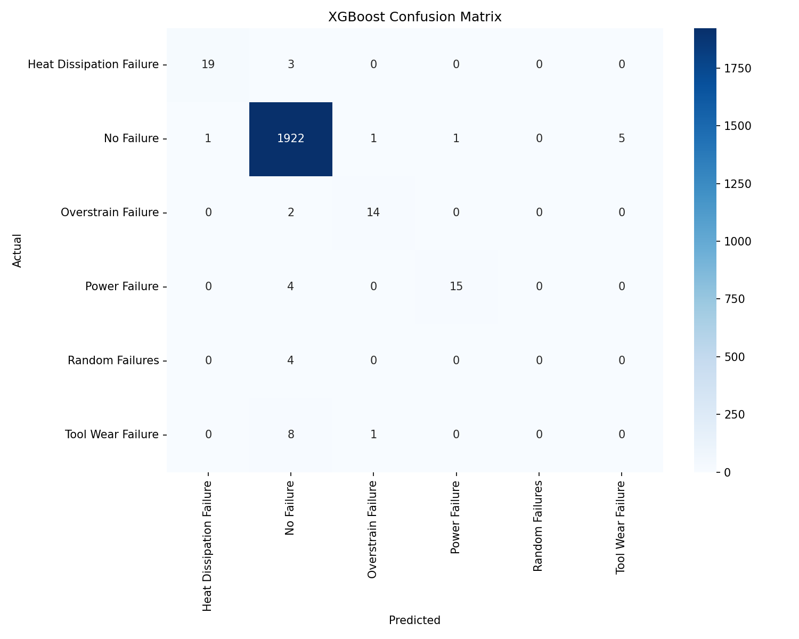
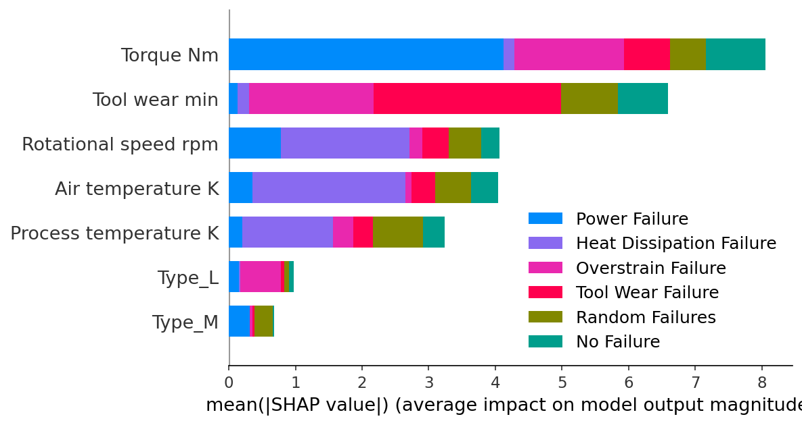

<div align="center">

# 🔧 Predictive Maintenance of Industrial Machinery

**ML-powered multi-class failure detection using real-world sensor data**

[](https://www.python.org/)
[](https://xgboost.readthedocs.io/)
[](https://scikit-learn.org/)
[](https://shap.readthedocs.io/)

> **AICTE-2026 Problem Statement No. 39** — Mechanical Engineering ML Track

</div>

---

## 📌 Problem Statement

Unexpected machine failures in industrial environments cause costly downtime and safety risks. This project builds a machine learning pipeline that **predicts the type of failure** before it occurs — enabling proactive maintenance scheduling.

| Failure Type | Count | % of Dataset |
|---|---|---|
| ✅ No Failure | 9,652 | 96.5% |
| 🌡️ Heat Dissipation Failure | 112 | 1.1% |
| ⚡ Power Failure | 95 | 0.95% |
| 💪 Overstrain Failure | 78 | 0.78% |
| 🔩 Tool Wear Failure | 45 | 0.45% |
| 🎲 Random Failures | 18 | 0.18% |

The **severe class imbalance** (96.5% non-failure) is the central challenge.

---

## 📊 Dataset

**Source:** [Machine Predictive Maintenance Classification](https://www.kaggle.com/datasets/shivamb/machine-predictive-maintenance-classification) on Kaggle

| Property | Value |
|---|---|
| Rows | 10,000 |
| Features | 7 (after preprocessing) |
| Target | `Failure Type` (6 classes) |
| Missing Values | None |

---

## 🧠 ML Approach
Raw Data (10,000 × 10)
│
▼
Preprocessing
├─ Drop UDI, Product ID
├─ One-hot encode Type (L/M/H)
└─ Stratified 80/20 train-test split
│
▼
Model Training
├─ Baseline: Decision Tree (max_depth=3)
├─ Random Forest (200 estimators, class_weight='balanced')
└─ XGBoost ← best model
│
▼
Explainability
└─ SHAP TreeExplainer (class-level feature importance)


---

## 📈 Results

| Model | Accuracy | Weighted F1 | **Macro F1** |
|---|---|---|---|
| Decision Tree (Baseline) | 97% | 0.96 | 0.28 |
| Random Forest | 98% | 0.98 | 0.52 |
| **XGBoost** | **98%** | **0.98** | **0.60** |

> ⚠️ **Macro F1** is the meaningful metric — accuracy is misleadingly high due to class imbalance.

### XGBoost Per-Class Performance

| Class | Precision | Recall | F1-Score |
|---|---|---|---|
| No Failure | 0.99 | 1.00 | **0.99** |
| Heat Dissipation Failure | 0.95 | 0.86 | **0.90** |
| Overstrain Failure | 0.88 | 0.88 | **0.88** |
| Power Failure | 0.94 | 0.79 | **0.86** |
| Tool Wear Failure | 0.00 | 0.00 | 0.00 |
| Random Failures | 0.00 | 0.00 | 0.00 |

> **Tool Wear Failure** (45 samples) and **Random Failures** (18 samples) remain undetected — a genuine dataset limitation given so few training examples.

### Confusion Matrix & SHAP Summary

<div align="center">

| Confusion Matrix | SHAP Feature Importance |
|:---:|:---:|
|  |  |

</div>

---

## 🔍 SHAP Explainability

SHAP was applied to the XGBoost model using `shap.TreeExplainer`. Results confirmed **Torque [Nm]** as the most influential feature overall, followed by **Tool wear [min]** — with Torque driving Power Failure predictions and Tool wear driving Tool Wear Failure predictions, validating physically meaningful relationships in the model.

---

## 🗂️ Project Structure

predictive-maintenance-ml/
├── predictive_maintenance.ipynb
├── predictive_maintenance.csv
├── confusion_matrix.png
├── shap_summary.png
└── README.md


---

## 🚀 Getting Started

```bash
pip install pandas numpy matplotlib seaborn scikit-learn xgboost shap
jupyter notebook predictive_maintenance.ipynb
```

**Note:** IBM Cloud Lite requires credit card verification for account access, which was not available. IBM Bob (bob.ibm.com) was used as the AI development tool to assist with code review and documentation for this project.

---

## 🛠️ Tech Stack

| Tool | Purpose |
|---|---|
| `pandas` / `numpy` | Data loading & preprocessing |
| `scikit-learn` | Decision Tree, Random Forest, metrics |
| `XGBoost` | Best-performing classifier |
| `SHAP` | Model explainability |
| `matplotlib` / `seaborn` | Visualizations |
| IBM Bob | AI-assisted code review & documentation |

---

## 🔮 Future Improvements

- [ ] Apply SMOTE or ADASYN to improve minority class detection
- [ ] Tune XGBoost hyperparameters with GridSearchCV
- [ ] Explore threshold optimization per class
- [ ] Add SHAP force plots for individual predictions

---

<div align="center">

**AICTE-2026 · Problem Statement No. 39 · Mechanical Engineering ML Track**

</div>